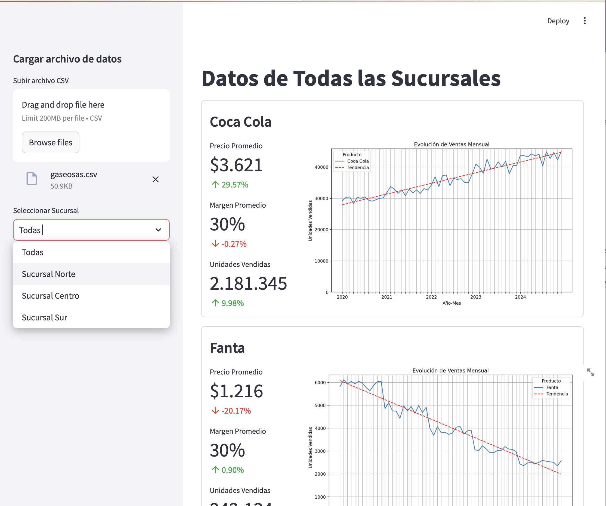

## Comisión 9 [21]

#### Resultados de la evaluación del segundo parcial.

> Los alumnos que presentaron el trabajo en tiempo y forma, pero tienen errores en los resultados y/o la presentación, pueden recuperar para acceder a la aprobación directa (si cumplen las demás condiciones).
>
> La recuperación debe ser *realizada y subida adecuadamente* hasta el **jueves al mediodía**.
            

### Aprobados (9) 
* `01` | **59336**  | Bulan Georgieff, Alexandre
* `02` | **58842**  | Fernández Licciardi, Mauricio
* `03` | **59310**  | Paz Berrondo, Nahuel Agustín
* `04` | **58679**  | Pereyra, Franco Sebastián
* `05` | **58869**  | Pérez, Enzo Matías
* `06` | **59313**  | Pisentte, Juan Pablo
* `08` | **58879**  | Ruiu, Andres
* `12` | **59320**  | Sbrocco, Micaela
* `15` | **59110**  | Soria, Joaquín
* `17` | **59074**  | Teseyra, Juan Ignacio

### Recuperar (8)

##### Debe corregir los resultados 
* `09` | **59073**  | Ruiz, Tomás Federico
* `16` | **58846**  | Sosa, Franco Maximiliano
* `19` | **59314**  | Yapura, Ramón Alejandro

##### Debe corregir resultados y presentación 
* `07` | **59057**  | Rocha, Lourdes Gabriela
* `10` | **58847**  | Sánchez, Tomás Emanuel
* `14` | **59059**  | Soraire, Elías Nicolás
* `18` | **59056**  | Villafañe, Lucas Gastón
* `21` | **59055**  | Saravia, Franco Nicolas

#### No presentaron <small>(3)</small>
* `11` | **59933**  | Saucedo, Lucas Nahuel
* `13` | **59568**  | Serrano, Lorenzo
* `20` | **59186**  | Roldan, Jesús

## ¿Cómo recuperar el trabajo?
**Para promocionar la materia, tanto los resultados como la presentación deben estar correctos.**

**Con respecto a los resultados...**
Los que deben recuperar tienen la cantidad de unidades correcta, pero el precio y el margen están mal calculados. 
Tomen los siguientes valores como referencia <small>(✦ Valores redondeados)</small>:
|Producto|Precio ✦|Unidades|
|--------|------:|-------:|
|Coca Cola|$ 3.621|2.181.345|
|Fanta|$ 1.216|242.134| 
|Pepsi|$ 2.512|1.440.104|

**Con respecto a la presentación...**
En la presentación debe reflejar la imagen de referencia.
- No debe mostrar ninguna tabla de datos.
- No debe tener ningún HTML o CSS para personalizar la presentación.
- La informacion de los productos deben estar con borde 
            `usar st.container(border=True)`.
- Las estadísticas deben mostrarse como métricas 
            `usar st.metric`.
- Las métricas deben mostrarse verticalmente.
- Las métricas deben estar en una columna a la izquierda del gráfico 
            `ocupando un 25%`.
- El gráfico debe estar a la decha 
            `ocupando el 75% restante`.
- La carga de datos se realiza en el panel lateral.    
- Los datos del usuario solo se muestran cuando no hay datos cargados.

## Recuperación

Los alumnos que deben recuperar deben presentar el trabajo corregido hasta el **jueves al mediodía**.

> **Nota:** Asegúrense de trabajar sobre la última versión de los archivos, bajando los datos antes de hacer la rama con las correcciones.
            Si tiene dudas puede consultar por el grupo de WhatsApp de la comisión.

#### Imagen de referencia             

            
